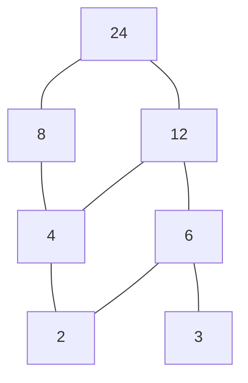

# Диаграмма Хассе

Диаграмма Хассе — компактное изображение конечного [[Отношение частичного порядка|частичного порядка]]. Она показывает отношения накрытия и не дублирует связи, которые уже следуют из транзитивности.

## Правила построения

1. Каждый элемент изображается точкой.
2. Если $a<b$, элемент $a$ располагается ниже $b$.
3. Соединяются только пары $a\lessdot b$, то есть пары без промежуточного элемента.
4. Петли $a\leq a$ не рисуются.
5. Стрелки обычно не нужны: направление читается снизу вверх.

## Пример с делителями

Для [[Отношение делимости|множества]]

$$
M=\{2,3,4,6,8,12,24\}
$$

отношения накрытия равны:

$$
2\lessdot4,\ 2\lessdot6,\ 3\lessdot6,\ 4\lessdot8,
$$

$$
4\lessdot12,\ 6\lessdot12,\ 8\lessdot24,\ 12\lessdot24.
$$

Связь $2$—$12$ не проводится, хотя $2\mid12$: она уже видна через цепочки $2<4<12$ и $2<6<12$.

## Как читать диаграмму

- Элементы, между которыми есть восходящий путь, сравнимы.
- Элементы без восходящего пути друг к другу могут быть несравнимы.
- Нижние и верхние вершины помогают находить [[Экстремальные элементы]].

> [!warning] Частая ошибка
> Диаграмма Хассе — не полный граф отношения. В ней намеренно опущены петли и транзитивные рёбра.

Связи: [[Отношение частичного порядка]] · [[Отношение делимости]] · [[Экстремальные элементы]]

